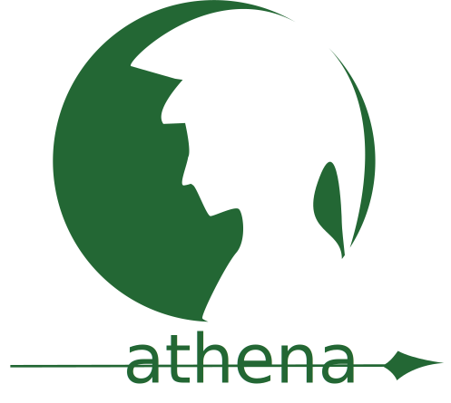

<p align="center">

</p>

# Athena v0.0.1
A mobile oriented web framework aimed at creating beautiful modern design effortlessly. Focused on endless customizability, by simply changing the variables in the variables.less file for almost every element without having to open mutliple files. 
A personal project I'm working on for fun. Feel free to use any of it as you wish.

---

## Table of Contents
* [File Structure](#file-structure)
* [Upcoming Elements](#upcoming-elements)
* [Credits](#credits)

## File Structure

```text
Athena/
├── dist/
│   ├── css/
│   │   ├── athena.css //To be added
│   │	└── athena.min.css //To be added
│   └── js/
│       ├── athena.js //To be added
│	└── athena.min.js //To be added
│
├── site/
│   └── imgs/
│   	└── logo.svg
│
└── src/
    ├── font/
    ├── imgs/
    ├── js/
    └── less/
        ├── elements/
	│   ├── buttons.less
	│   ├── card.less
	│   ├── gallery.less
        │   ├── images.less
 	│   └── links.less
 	│
        ├── shortcuts/
	│   ├── mixins.less
 	│   └── text.less
 	│
        ├── athena.less
        ├── global.less
 	└── variables.less
```

## Upcoming Elements
* Navbar
* Typography base header
* Broken Grid Styling
* Rating
* Buttons
* Pop-Ups
* Ads?
* Side Sticky

## Credits
* [Boostrap](https://github.com/twbs/bootstrap), Used for reference
* [Clique.UI](https://github.com/CliqueStudios/Clique.UI), Used for reference
* [uiGradients](https://uigradients.com/), Used to create gradient combinations
* [Circle Image Implementation](https://medium.com/@biancapower/how-to-make-a-rectangle-image-a-circle-in-css-2f392bc9abd3)
